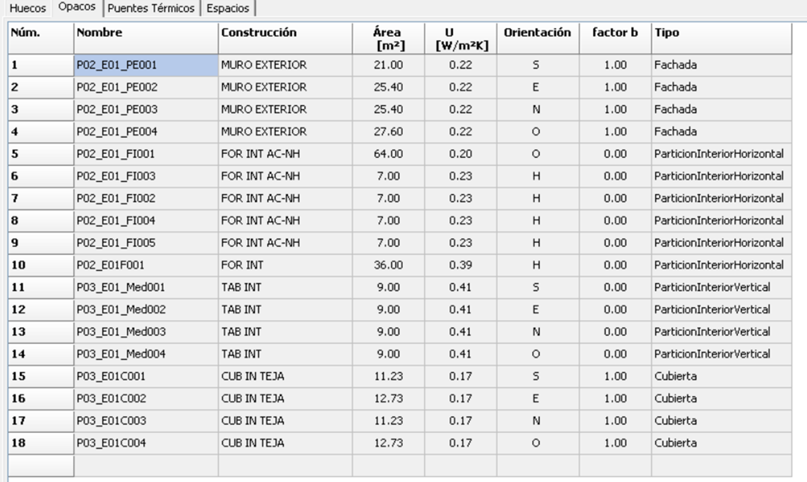
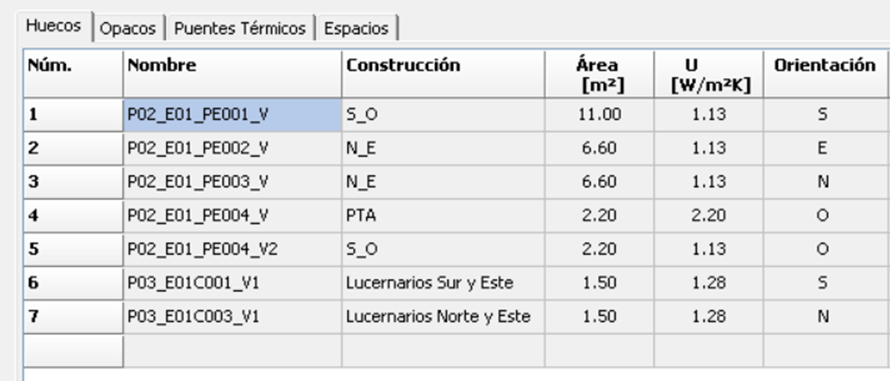

# Thermal Transmittance of Opaque Enclosures (`Transmitancia Térmica, U`)

This is the fundamental property for heat transfer through walls, roofs, and floors.

#### General Formula for Homogeneous Layers
**Formula:**

`U = 1 / R_T`

`R_T = R_se + R_1 + R_2 + ... + R_n + R_si`

**Where:**
*   `U`: Thermal Transmittance [W/m²·K]
*   `R_T`: Total Thermal Resistance [m²·K/W]
*   `R_se`: External Surface Resistance [m²·K/W]
*   `R_si`: Internal Surface Resistance [m²·K/W]
*   `R_n`: Thermal Resistance of layer 'n' [m²·K/W]

**Layer Resistance:**
`R_n = e_n / λ_n`

**Where:**
*   `e_n`: Thickness of layer 'n' [m]
*   `λ_n`: Thermal Conductivity of layer 'n' [W/m·K]

#### For Partitions with Non-Habitable Spaces

**Formula:**
`U_corrected = U_p · b`

**Where:**
*   `U_p`: U-value of the partition calculated with standard interior surface resistances.
*   `b`: Temperature reduction coefficient (obtained from tables in DA DB-HE/1 based on ventilation level and area ratio `A_h-nh / A_nh-e`).

---

### Global Heat Transfer Coefficient (`Coeficiente global de transmisión de calor, K`)

This measures the average thermal quality of the entire envelope in contact with the exterior.

**Formula:**

`K = (Σ H_x) / A_int`

**Simplified Calculation Formula:**

`K = [ Σ ( b_1,x · ( Σ (A_xi · U_xi) + Σ (l_xk · ψ_xk) + Σ (χ_xi) ) ) ] / [ Σ ( b_1,x · A_xi ) ]`

**Where:**
*   
* `K`: Global Heat Transfer Coefficient [W/m²·K]
* `H_x`: Heat Transfer Coefficient of element 'x' [W/K]
* `A_int`: Total area of the envelope in contact with exterior/ground [m²]
* `b_1,x`: Adjustment factor (1 for elements in contact with exterior/ground, 0 for adjacent buildings)
* `A_xi`: Area of element 'x' [m²]
* `U_xi`: U-value of element 'x' [W/m²·K]
* `l_xk`: Length of thermal bridge 'k' [m]
* `ψ_xk`: Linear Thermal Transmittance of thermal bridge 'k' [W/m·K]
* `χ_xi`: Point Thermal Transmittance of thermal bridge 'i' [W/K] (often neglected)

---

### Solar Control Parameter (`Parámetro de control solar, q_sol,jul`)

This controls solar heat gains during the summer.

**Formula:**
`q_sol,jul = Q_sol,jul / A_util`

**Where:**
*   `q_sol,jul`: Solar Control Parameter [kWh/m²·month]
*   `Q_sol,jul`: Total solar gains in July [kWh/month]
*   `A_util`: Useful floor area of the building [m²]

**Solar Gain through a single aperture:**

`Q_sol,hueco = F_sh,obst · g_glsh,wi · (1 - F_frame) · A_hueco · H_sol,jul`

**Where:**
*   `F_sh,obst`: Shading factor from external obstructions [-]
*   `g_glsh,wi`: Total solar energy transmittance of the glazing with shading device active [-]
*   `F_frame`: Frame fraction of the window [-]
*   `A_hueco`: Area of the window [m²]
*   `H_sol,jul`: Solar irradiation on the window in July [kWh/m²]

---

### Air Tightness (`Estanqueidad al aire`)

#### For Apertures (Windows/Doors)
**Parameter:** `Q_100` - Permeability at 100 Pa [m³/(h·m²)]
No formula is given; it's a performance value from testing and product classification.

#### For the Whole Building Envelope
**Parameter:** `n_50` - Air changes per hour at 50 Pa [h⁻¹]

**Calculation Formula:**
`n_50 = 0.629 · (C_o · A_o + C_h · A_h) / V`

**Where:**
*   `n_50`: Air change rate at 50 Pa [h⁻¹]
*   `0.629`: Conversion factor between 100 Pa and 50 Pa
*   `C_o`: Airflow coefficient for opaque parts at 100 Pa [m³/(h·m²)] (16 for new buildings)
*   `A_o`: Area of opaque envelope [m²]
*   `C_h`: Airflow coefficient for apertures at 100 Pa [m³/(h·m²)] (equal to their `Q_100` value, e.g., 9 for Class 3)
*   `A_h`: Area of apertures [m²]
*   `V`: Internal air volume of the building [m³]

---

### Thermal Bridge Calculations (`Puentes térmicos`)

**Linear Thermal Transmittance (Ψ-value):**
`Ψ = L_2D - Σ (U_i · l_i)`

**Where (Conceptual):**
*   `Ψ`: Linear Thermal Transmittance [W/m·K]
*   `L_2D`: Thermal Coupling Coefficient from a 2D simulation [W/m·K]
*   `U_i`: U-value of adjoining element 'i' [W/m²·K]
*   `l_i`: Length associated with element 'i' [m]

*(Note: In practice, Ψ-values are taken from catalogues like DA DB-HE/3, not calculated manually in this document).*

---

### Geometric Properties

#### Compactness (`Compacidad`)
**Formula:**
`Compactness = V / A`

**Where:**
*   `V`: Total volume enclosed by the thermal envelope [m³]
*   `A`: Total area of the envelope in thermal contact with the exterior or ground [m²]

---

### Condensation Analysis (`Análisis de condensaciones`)

#### Saturation Vapor Pressure (`Presión de saturación, P_sat`)
**Magnus Formula:**
`P_sat = 610.5 · exp( (17.269 · θ) / (237.3 + θ) )`

**Where:**
*   `P_sat`: Saturation Vapor Pressure [Pa]
*   `θ`: Temperature [°C]

#### Actual Vapor Pressure (`Presión de vapor, P`)
`P = HR · P_sat(θ)`

**Where:**
*   `HR`: Relative Humidity [0-1]

#### Vapor Pressure at an Interface
`P_x = P_e + ( (ΣSd_x) / Sd_total ) · (P_i - P_e)`

**Where:**
*   `P_x`: Vapor Pressure at point x [Pa]
*   `P_e`, `P_i`: Exterior and Interior Vapor Pressures [Pa]
*   `ΣSd_x`: Cumulative equivalent air thickness from exterior to point x [m]
*   `Sd_total`: Total equivalent air thickness of the assembly [m]
*   `Sd` for a layer: `Sd = e · μ` (where `μ` is the vapor resistance factor)

#### Temperature at an Interface
`θ_x = θ_e + ( (R_se + ΣR_x) / R_T ) · (θ_i - θ_e)`

**Where:**
*   `θ_x`: Temperature at point x [°C]
*   `θ_e`, `θ_i`: Exterior and Interior Temperatures [°C]
*   `ΣR_x`: Cumulative thermal resistance from exterior to point x [m²·K/W]
*   `R_T`: Total thermal resistance of the assembly [m²·K/W]

These formulas provide the complete toolkit used in the document to define, calculate, and verify the energy performance of the building's thermal envelope according to the Spanish CTE DB-HE.

