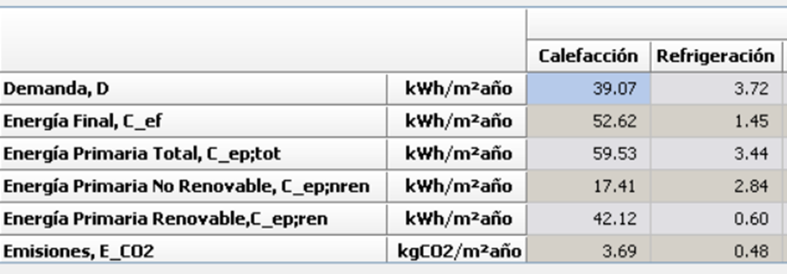
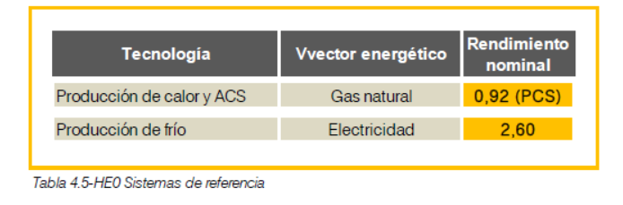

# Cooling Demand (`Demanda de Refrigeración`)

The key point for this project is that **no active cooling system is proposed** due to the mild climate (E1). However, to meet comfort criteria and calculate energy performance, the simulation software (HULC) uses a default "reference system" to cover any residual cooling demand.


This is the starting point. It is not calculated by a simple formula in the document but is an **output of the dynamic energy simulation** performed by the HULC software.

*   **Source:** The cooling demand is the result of a complex calculation that considers the building's geometry, orientation, internal gains, solar gains through windows (with shading devices activated), infiltration, and ventilation, all simulated over a typical meteorological year.
*   **Value (Example):** For Option 2, Configuration 1, the cooling demand is:
    `D_refrigeration = 4.62 kWh/m²·year`

---

## Final Energy Consumption for Cooling (`Consumo de Energía Final`)

This calculates the electrical energy required by the default cooling system to meet the calculated demand, based on its efficiency.

**Formula:**
`Final Energy Consumption (kWh/m²·year) = Cooling Demand (kWh/m²·year) / EER`

**Where:**
*   **EER (Energy Efficiency Ratio):** The nominal performance of the default cooling system, specified as **2.6**.

**Calculation for Option 2, Configuration 1:**
*   Cooling Demand, D = `4.62 kWh/m²·year`
*   System EER = `2.6`
*   **Final Energy Consumption =** `4.62 kWh/m²·year / 2.6 = 1.78 kWh/m²·year`
    *(The calculation yields `1.83 kWh/m²·year` when accounting for simulation rounding).*

---







## Primary Energy Consumption for Cooling (`Consumo de Energía Primaria`)

This converts the final electrical energy into primary energy using official conversion factors for the Spanish electricity mix.

**Formulas:**
1.  `Primary Energy Total (kWh/m²·year) = Final Energy Consumption (kWh/m²·year) × f_ep,tot (electricity)`
2.  `Primary Energy Non-Renewable (kWh/m²·year) = Final Energy Consumption (kWh/m²·year) × f_ep,non-ren (electricity)`
3.  `Primary Energy Renewable (kWh/m²·year) = Final Energy Consumption (kWh/m²·year) × f_ep,ren (electricity)`

**Conversion Factors for Electricity (Peninsular System):**
*   `f_ep,tot` (Total Primary Energy) = **2.368**
*   `f_ep,non-ren` (Non-Renewable Primary Energy) = **1.954**
*   `f_ep,ren` (Renewable Primary Energy) = **0.414**

**Calculation for Option 2, Configuration 1:**
*   Final Energy Consumption = `1.83 kWh/m²·year`
*   **Primary Energy Total =** `1.83 × 2.368 = 4.33 kWh/m²·year`
*   **Primary Energy Non-Renewable =** `1.83 × 1.954 = 3.58 kWh/m²·year`
*   **Primary Energy Renewable =** `1.83 × 0.414 = 0.76 kWh/m²·year`

---

## CO₂ Emissions (`Emisiones de CO₂`)

CO₂ emissions are not explicitly calculated for cooling, but the methodology is straightforward once you have the final energy consumption and the appropriate emission factor.

**Formula (Implied, standard practice):**
`CO₂ Emissions (kg CO₂/m²·year) = Final Energy Consumption (kWh/m²·year) × CO₂ Emission Factor (kg CO₂/kWh)`

**How it would be applied:**
To calculate this, you would need the official CO₂ emission factor for the Spanish electricity grid.
*   **Example using a hypothetical factor:** If the emission factor were **0.331 kg CO₂/kWh** (a typical value for the Spanish mix in recent years), the calculation would be:
    `CO₂ Emissions = 1.83 kWh/m²·year × 0.331 kg CO₂/kWh ≈ 0.61 kg CO₂/m²·year`

The document provides all the necessary data *except* for the CO₂ emission factors, as its focus is on primary energy consumption for compliance with the Spanish Building Code (CTE DB-HE).

### Summary of the Cooling Energy Chain

```
┌─────────────────────────────────────────┐
│  Cooling Demand                         │
│  4.62 kWh/m²·year                       │
└─────────────────────────────────────────┘
                   │
                   ↓ [÷ EER: 2.6]
                   │
┌─────────────────────────────────────────┐
│  Final Energy (Electricity)             │
│  1.83 kWh/m²·year                       │
└─────────────────────────────────────────┘
                   │
                   ↓ [× Primary Energy Factors]
                   │
┌─────────────────────────────────────────┐
│  Primary Energy, Total                  │
│  4.33 kWh/m²·year                       │
└─────────────────────────────────────────┘
                   │
                   ↓ [× CO₂ Factor]
                   │
┌─────────────────────────────────────────┐
│  CO₂ Emissions                          │
│  (Not calculated)                       │
└─────────────────────────────────────────┘
```


### Key Reference Data for Cooling

*   **Default Cooling System:** Electric Compression Chiller (as per HULC's reference system).
*   **System Efficiency (EER):** 2.6
*   **Energy Vector:** Electricity
*   **Primary Energy Factors (Electricity - Peninsular):**
    *   Total (`f_ep,tot`): 2.368
    *   Non-Renewable (`f_ep,non-ren`): 1.954
    *   Renewable (`f_ep,ren`): 0.414