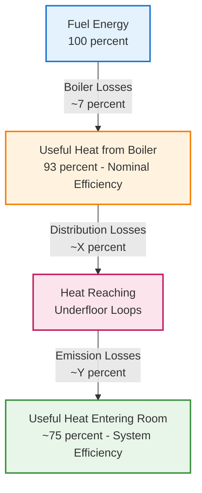
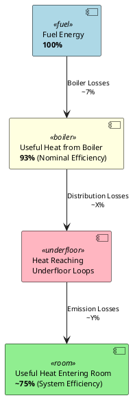

# Heating System

The heating system for this single-family home is a biomass pellet boiler that feeds a low-temperature water-based underfloor heating system.

## Heating Power Distribution and Sizing

This calculation determines the required thermal power output for each room based on the heated surface area and the average emission power of the underfloor heating system.

**Formula:**
`Heating Power (W) = Surface Area (m²) × Average Emission Power (W/m²)`

*   **Ground Floor (P02) - Emission Power: 70 W/m²**
    *   Kitchen-Dining-Living Room: `28.80 m² × 70 W/m² = 2,016 W`
    *   Entrance + Hallway: `13.44 m² × 70 W/m² = 941 W`
    *   Toilet: `4.14 m² × 70 W/m² = 290 W`
    *   Main Bedroom: `17.62 m² × 70 W/m² = 1,233 W`
    *   **Total Ground Floor Power:** `64.00 m² × 70 W/m² = 4,480 W`

*   **Attic Floor (P03) - Emission Power: 85 W/m²**
    *   Bedroom: `29.15 m² × 85 W/m² = 2,478 W`
    *   Toilet: `6.85 m² × 85 W/m² = 582 W`
    *   **Total Attic Floor Power:** `36.00 m² × 85 W/m² = 3,060 W`

*   **Total Building Heating Power:** `4,480 W + 3,060 W = 7,540 W`

---

## Final Energy Consumption for Heating

This calculation converts the heating demand into the actual amount of final energy (biomass pellets) that needs to be purchased, taking the boiler's efficiency into account.

**Formula:**
`Final Energy Consumption (kWh/m²·year) = Heating Demand (kWh/m²·year) / Boiler Efficiency`

*   Heating Demand, D = `39.45 kWh/m²·year`
*   Boiler Nominal Efficiency = `93%` or `0.93`
*   **Final Energy Consumption =** `39.45 kWh/m²·year / 0.93 = 42.17 kWh/m²·year`

---

## Nominal Efficiency versus Overall Efficiency

The nominal efficiency of the boiler (0.93) is not the same as the overall system efficiency from fuel input to useful heat in the rooms.

The nominal boiler efficiency only accounts for losses within the boiler itself (combustion inefficiency and heat lost through the flue). It does not include other significant losses in the system. Your calculated overall efficiency of ~0.75 is entirely plausible and points to these other sources of power loss.

Here are the other sources of power loss for the heated floor system that explain the difference between the boiler's nominal efficiency and the effective system efficiency you calculated:

#### Distribution Losses (Pérdidas de distribución)

This is often the most significant loss after the boiler. The pipes that carry hot water from the boiler to the underfloor heating loops (and back) lose heat to their surroundings.

*   **Location:** These pipes often run through unheated spaces like the sanitary crawl space (`Cámara Sanitaria`), which, as per the document, is a non-habitable space at a much lower temperature.
*   **Impact:** Heat that escapes from these pipes warms the crawl space instead of the living areas, constituting a direct loss. While the document's main energy calculation might account for this indirectly through the building's overall heat demand, a detailed system loss calculation would include it explicitly.
*   **Formula (Conceptual):** `Q_dist_loss = U_pipe * L_pipe * DeltaT * time`
    *   `U_pipe`: Thermal transmittance of the insulated pipe (W/m·K).
    *   `L_pipe`: Total length of the distribution pipes in unheated spaces (m).
    *   `DeltaT`: Difference between average water temperature in the pipe and the temperature of the unheated space (K).

#### Emission / Installation Losses (Pérdidas de emisión)

These are losses from the underfloor heating system itself downwards or sideways into unheated areas.

*   **Location:** The construction details show a floor assembly with insulation (XPS). However, if the insulation is not continuous, is under-dimensioned, or if there are thermal bridges (e.g., at the edges), heat from the underfloor loops will be lost downward.
*   **Impact:** This is heat that is "emitted" by the system but does not contribute to heating the intended space because it leaks into the ground or another non-habitable zone below.
*   The calculated U-value for the floor separating the ground floor from the sanitary crawl space (`F2.1`) is **0.19 W/m²K**. This means heat is constantly flowing from the heated floor into the crawl space, which is a direct emission loss.

#### Regulation and Control Losses (Pérdidas por regulación)

No control system is perfect. Inefficiencies arise from:

*   **Overshooting:** The system heats slightly more than necessary.
*   **Hysteresis:** The system turns on/off around the setpoint, leading to an average temperature slightly different from the theoretical one.
*   **Inertia Mismatch:** The slow response time of underfloor heating can lead to periods where heat is being emitted even after the demand has been met.

#### Summary: The "System Efficiency" vs. "Boiler Efficiency"

The overall process from fuel to room heat looks like this, with losses at every stage:

 ```
 ┌─────────────────────────────────────────┐
 │      Fuel Energy (100%)                 │
 └─────────────────────────────────────────┘
                │
                ↓ [Boiler Losses ~7%]
                │
 ┌─────────────────────────────────────────┐
 │  Useful Heat from Boiler                │
 │  (93% - Nominal Efficiency)             │
 └─────────────────────────────────────────┘
                │
                ↓ [Distribution Losses ~X%]
                │
 ┌─────────────────────────────────────────┐
 │  Heat Reaching Underfloor Loops         │
 └─────────────────────────────────────────┘
                │
                ↓ [Emission Losses ~Y%]
                │
 ┌─────────────────────────────────────────┐
 │  Useful Heat Entering Room              │
 │  (~75% - System Efficiency)             │
 └─────────────────────────────────────────┘
 ```





**Conclusion:**

HULC calculation of an effective **0.75 system efficiency** is realistic and correct from an overall energy balance perspective. It accounts for the **sum** of:

1.  **Boiler Losses** (Nominal 7%)
2.  **Distribution Losses** (Pipes in crawl space)
3.  **Emission Losses** (Through the floor into the crawl space)
4.  **Regulation Losses**

---

## Primary Energy Consumption for Heating

This calculation converts the final energy consumption into primary energy (the energy from the source, considering extraction, processing, and transport) using official conversion factors.

**Formulas:**
1.  `Primary Energy Total (kWh/m²·year) = Final Energy Consumption (kWh/m²·year) × f_ep,tot`
2.  `Primary Energy Non-Renewable (kWh/m²·year) = Final Energy Consumption (kWh/m²·year) × f_ep,non-ren`
3.  `Primary Energy Renewable (kWh/m²·year) = Final Energy Consumption (kWh/m²·year) × f_ep,ren`

**Calculation for Option 2, Configuration 1:**
*   Final Energy Consumption = `42.17 kWh/m²·year`
*   Conversion Factors for Densified Biomass (Pellets):
    *   `f_ep,tot` (Total) = `1.113`
    *   `f_ep,non-ren` (Non-Renewable) = `0.085`
    *   `f_ep,ren` (Renewable) = `1.028`
*   **Primary Energy Total =** `42.17 × 1.113 = 46.94 kWh/m²·year`
*   **Primary Energy Non-Renewable =** `42.17 × 0.085 = 3.58 kWh/m²·year`
*   **Primary Energy Renewable =** `42.17 × 1.028 = 43.35 kWh/m²·year`

---

## Heat Loss Calculation for ACS Accumulator (Relevant for the mixed system)

Although this formula is in the ACS (Domestic Hot Water) section, it is highly relevant as the heating boiler also produces hot water. The formula calculates the heat losses from the storage tank.

**Formula:**
`Q = A · U · DeltaT · Number of hours in the period`

**Where:**
*   `Q`: Heat losses produced in the accumulator during the period (Wh)
*   `A`: Surface area of the accumulator's envelope (m²)
*   `U`: Thermal transmittance of the accumulator's envelope (W/m²·K)
*   `DeltaT`: Temperature difference between the inside of the tank and the ambient temperature outside it (°C)

**Simplified Application:**
`A · U` can be simplified into a single "loss coefficient" for the tank.
*   For a 100-liter tank (Options 1 & 2): Loss coefficient `A·U = 0.5 W/°C`
*   Assumed `DeltaT`: `65°C (internal) - 20°C (ambient) = 45°C`
*   **Daily average loss for January (744 hours):** `Q_daily = (0.5 W/°C × 45°C × 744 h) / 31 days = 540 Wh/day`

---

## Summary of Key Heating System Data:

*   **Production:** Individual biomass boiler.
*   **Thermal Power:** 25 kW.
*   **Fuel:** Biomass Pellets.
*   **Nominal Efficiency:** 93%.
*   **Distribution:** Water circuit with a supply temperature of 45°C.
*   **Emitters:** Underfloor heating.
    *   Ground Floor: `70 W/m²`
    *   Attic Floor: `85 W/m²`