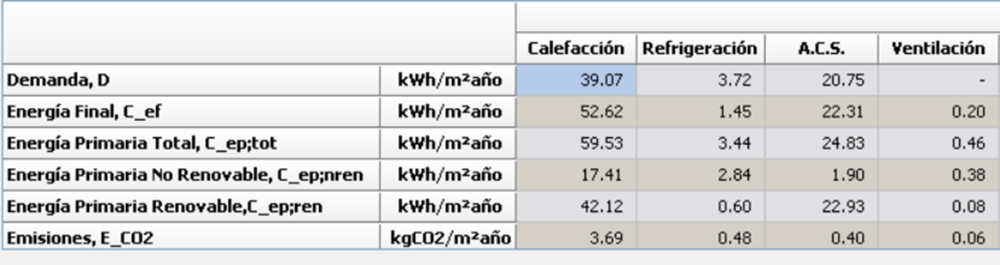

# Ventilation System
The document specifies a **hybrid ventilation system** for all options, complying with the Spanish Building Code's DB HS3 "Indoor Air Quality".

*   **Type:** Hybrid Ventilation (`Ventilación híbrida`).
*   **Air Admission:** Natural, through window vents or air inlets in the "dry rooms" (`locales secos`), such as bedrooms, living rooms, and dining rooms.
*   **Air Extraction:** Mechanical, using extractor fans in the "wet rooms" (`locales húmedos`), such as the kitchen, bathrooms, and toilets. The extracted air is expelled to the outside through the roof.
*   **Air Transfer:** Air transfers from dry rooms to wet rooms through door undercuts, assuming sufficient cross-section for the necessary airflow.
*   **Heat Recovery:** Not included in the proposed system.

---

## Airflow Calculation and Sizing

The airflow rates are determined based on **DB HS3 Table 2.1**, which sets minimum ventilation flow rates based on the number of bedrooms.

### Formula for Total Flow Rate:
`Total Minimum Extraction Flow Rate (l/s) = Σ (Extraction flow per wet room)`

The "balanced reference flow rate" (`Caudal de referencia equilibrado`) is the higher value between the total admission flow and the total extraction flow, used for system sizing.

**Calculations:**

**Option 2: 2 Bedrooms**
*   **Admission (Dry Rooms):**
    *   Main Bedroom: 8 l/s
    *   Bedroom 2: 4 l/s
    *   Living-Dining Room: 8 l/s
    *   **Total Admission:** `20 l/s`
*   **Extraction (Wet Rooms):**
    *   Kitchen: 7 l/s
    *   Toilet (Ground Floor): 7 l/s
    *   Toilet (Attic): 7 l/s
    *   **Total Extraction:** `21 l/s`
    *   **Code Minimum Extraction:** `24 l/s` (This value governs)
*   **Balanced Reference Flow Rate:** `24 l/s` = **86.4 m³/h**
*   **Equipment:** Two multi-duct extractors, each with a maximum flow rate (`Q max.`) of `50 m³/h` and a power of `4 W` each.

**Option 3: 3 Bedrooms**
*   **Admission (Dry Rooms):**
    *   Main Bedroom: 8 l/s
    *   Bedroom 2: 4 l/s
    *   Bedroom 3: 4 l/s
    *   Living-Dining Room: 8 l/s
    *   Attic Living Area: 4 l/s
    *   **Total Admission:** `28 l/s`
*   **Extraction (Wet Rooms):**
    *   Kitchen: 8 l/s
    *   Toilet (Ground Floor): 8 l/s
    *   Toilet 1 (Attic): 8 l/s
    *   Toilet 2 (Attic): 8 l/s
    *   **Total Extraction:** `32 l/s`
    *   **Code Minimum Extraction:** `33 l/s` (This value governs)
*   **Balanced Reference Flow Rate:** `33 l/s` = **118.8 m³/h**
*   **Equipment:** Two multi-duct extractors, each with a maximum flow rate (`Q max.`) of `75 m³/h` and a power of `5 W` each.

---

## Energy Consumption Calculation for Ventilation

The energy consumption is calculated based on the electrical power of the extractor fans and their assumed operation.

**Formula (Conceptual):**
`Energy Consumption (kWh/year) = Total Installed Power (kW) × Daily Operating Hours (h/day) × 365 days/year`

**Calculation for Option 2, Configuration 1:**
*   The simulation software (HULC) calculates the final energy consumption for ventilation.
*   **Final Energy Consumption for Ventilation:** `0.54 kWh/m²·year`
*   **Total Useful Floor Area (Option 2):** `100 m²`
*   **Total Final Energy Consumption:** `0.54 kWh/m²·year × 100 m² = 54 kWh/year`

This value of 54 kWh/year for the whole building aligns with the power of the two extractors (2 × 4W = 8W) running for a significant portion of the day.

---

## Primary Energy Consumption for Ventilation

As with cooling, the electrical energy for ventilation is converted to primary energy using the same factors.

**Formulas:**
1.  `Primary Energy Total (kWh/m²·year) = Final Energy Consumption (kWh/m²·year) × f_ep,tot (electricity)`
2.  `Primary Energy Non-Renewable (kWh/m²·year) = Final Energy Consumption (kWh/m²·year) × f_ep,non-ren (electricity)`

**Calculation for Option 2, Configuration 1:**
*   Final Energy Consumption = `0.54 kWh/m²·year`
*   **Primary Energy Total =** `0.54 × 2.368 = 1.28 kWh/m²·year`
*   **Primary Energy Non-Renewable =** `0.54 × 1.954 = 1.06 kWh/m²·year`

## Summary of Ventilation Data:

| Aspect | Option 2 | Option 3 |
| :--- | :--- | :--- |
| **System Type** | Hybrid (Natural Admission, Mechanical Extraction) | Hybrid (Natural Admission, Mechanical Extraction) |
| **Total Extraction Flow** | **24 l/s** (86.4 m³/h) | **33 l/s** (118.8 m³/h) |
| **Equipment** | 2 × Multi-duct Extractors | 2 × Multi-duct Extractors |
| **Unit Power / Flow** | 4 W / 50 m³/h | 5 W / 75 m³/h |
| **Final Energy (from HULC)** | 0.54 kWh/m²·year | (Not explicitly stated, but calculable) |
| **Primary Energy Total** | 1.28 kWh/m²·year | (Not explicitly stated, but calculable) |