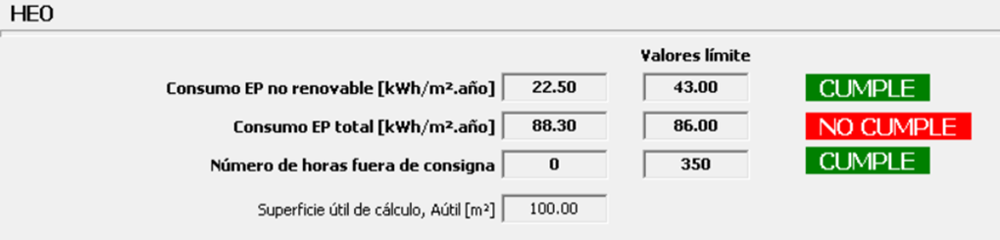
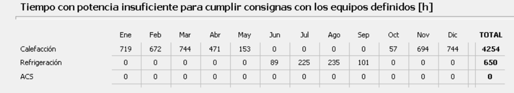
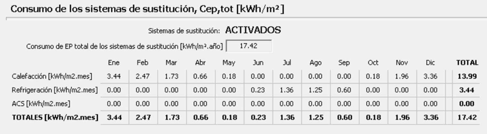
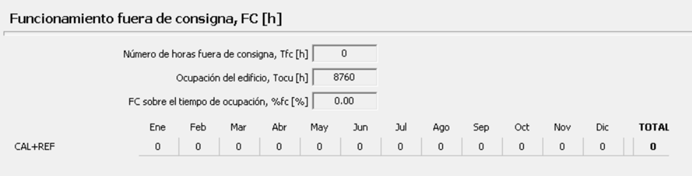

# Summary

- [Heating System](Ejemplo1_Config2_Heating.md)
- [Water Heating (ACS)](Ejemplo1_Config2_Water_Heating.md)
- [Cooling](Ejemplo1_Config2_Cooling.md)
- [Ventilation](Ejemplo1_Config2_Ventilation.md)
- [Condensations](Ejemplo1_Config2_Condensations.md)
- [Air Tightness](Ejemplo1_Config2_Air_Tightness.md)

